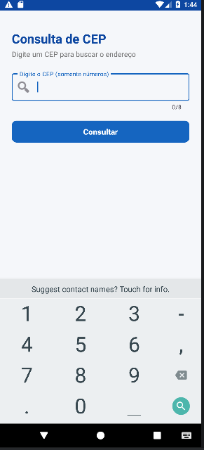

# Consulta CEP

## Descrição
Aplicativo Android que consulta o endereço a partir de um CEP brasileiro.
O usuário digita um CEP, o app consulta a API pública ViaCEP e exibe o
endereço completo (logradouro, bairro, cidade, estado e DDD). O objetivo é
facilitar o preenchimento e a verificação de endereços a partir do CEP,
sem precisar pesquisar manualmente.

## API utilizada
- Nome da API: ViaCEP
- Endpoint utilizado: `https://viacep.com.br/ws/{cep}/json/`
- Exemplo de URL consultada: `https://viacep.com.br/ws/28300000/json/`
- Principais dados retornados: logradouro, bairro, localidade (cidade),
  uf (estado) e ddd.

## Funcionalidades
- Entrada de dados pelo usuário (campo de CEP)
- Validação de campo vazio
- Validação de formato (exige 8 dígitos numéricos)
- Consulta a uma API pública (ViaCEP)
- Exibição dos dados retornados em um card organizado
- Tratamento básico de erro (CEP não encontrado e falha de conexão)

## Tecnologias utilizadas
- Kotlin
- Android Studio
- XML (layout)
- Volley (biblioteca de requisição HTTP)
- API pública ViaCEP
- ViewBinding

## Permissões utilizadas
O aplicativo utiliza a permissão INTERNET para realizar requisições à API pública.

```xml
<uses-permission android:name="android.permission.INTERNET" />
```

## Como executar o projeto
1. Clonar este repositório.
2. Abrir o projeto no Android Studio.
3. Aguardar a sincronização do Gradle.
4. Executar o app em um emulador ou dispositivo físico.
5. Informar um CEP válido (somente números, ex.: `28300000`) e clicar em Consultar.

## Prints do aplicativo




## Autor
Lucas Gonçalves Pompilho - 2569056
